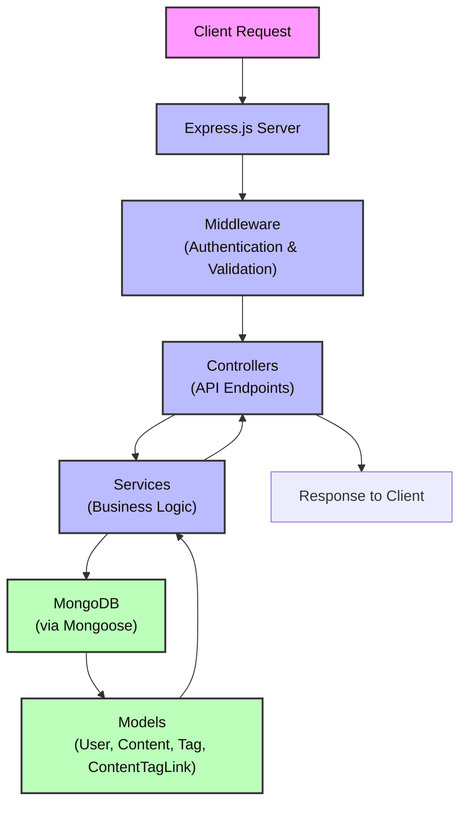

# Brainsily – Full Stack Application

Brainsily is a full-stack **content management and sharing platform** designed as a “second brain” to organize, manage, and share useful content like Tweets, YouTube videos, and text notes.

This project is a **practice-driven build** focused on strengthening both frontend and backend development using modern technologies.

🔗 **Live Demo**: https://brainsily.vercel.app/

---

## **Table of Contents**

1. [Project Overview](#project-overview)
2. [Tech Stack](#tech-stack)
3. [Setup Instructions](#setup-instructions)
4. [Available Scripts](#available-scripts)
5. [Features](#features)
6. [Acknowledgements](#acknowledgements)
7. [Screenshots](#screenshots)

---

## Project Overview

Brainsily allows users to:
- Save and organize different types of content
- Manage content through a clean dashboard
- Share their curated “brain” publicly via links

---

## Tech Stack

### Frontend
- React 18
- React Router DOM 7
- TypeScript
- TailwindCSS
- Axios
- Vite
- Zod (validation)

### Backend
- Node.js + Express.js
- TypeScript
- MongoDB (Mongoose)
- JWT Authentication
- Zod (validation)
- bcrypt (password hashing)
- dotenv

---

## Architecture




The Brainsily backend is a MERN-based application built with Express.js, managing API endpoints in `index.ts` with JWT authentication and Mongoose schemas (`db.ts`) for User, Content, Tag, and ContentTagLink models. The `middleware/user.ts` handles authentication, while `Utils` and `types` support encryption and type safety. Data flows from API requests to MongoDB storage, validated by Zod—all custom-built with no external services. It’s a proof-of-concept focused on functionality and growth.

---

## Features

- **User Signup**: Create an user account with secure password hashing.
- **User Login**: Login and receive a JWT for authentication.
- **Get All Content**: Retrieve a list of courses created by the admin.
- **Create Content**: Add new content with details like title, body or link, content type like tweet, youtube.
- **Delete Content**: Delete content.
- **Share Brain**: Share your brain content by making it public.
- **View Shared Brain**: View shared brain content by given url.

Find API Doc in [endpoint.md](./backend/endpoints.md)

- **Welcome Page**: A warm introduction to the application.
- **Signup & Login**: Authentication system to create or access user accounts.
- **Dashboard**: A content management interface allowing users to create, view, and manage their content.
  - Add new content with various `contentFormat` types (e.g., text, tweet, YouTube video, link).
  - Select and filter content based on type.

---

## Setup Instructions

### Prerequisites
- Node.js (v18+)
- npm / yarn
- MongoDB (local or cloud)

---

### 1. Clone Repository
```bash
git clone https://github.com/tsMukesh51/WebDev.git
```

---

### 2. Setup Backend
```bash
cd backend

npm install
```

Create `.env`:
```env
JWT_SECRET=your_secret
MONGO_URL=your_mongodb_url
SHRD_SECRET=your_shared_secret
```

Run backend:
```bash
npm run dev
```

Backend runs on:
```
http://localhost:3000
```

---

### 3. Setup Frontend
```bash
cd ../frontend

npm install
npm run dev
```

Frontend runs on:
```
http://localhost:5173
```

---

## Environment Variables

| Variable    | Description |
|------------|------------|
| JWT_SECRET | JWT signing key |
| MONGO_URL  | MongoDB connection string |
| SHRD_SECRET | Secret for shared links |

---

## Screenshots

1. **Welcome Page**
   

2. **Login Page**
   

3. **Dashboard Overview**
   

4. **Adding New Content**
   

5. **Selecting a Content Type**
   

---

## Acknowledgements

- Thanks to **Kirat** for guidance during development
- Built as part of hands-on full-stack learning

---

<!-- ## **License**
This project currently does not have a license. If you'd like to add one, consider reviewing the [Open Source Initiative](https://opensource.org/licenses) to select a suitable license for your project. -->


